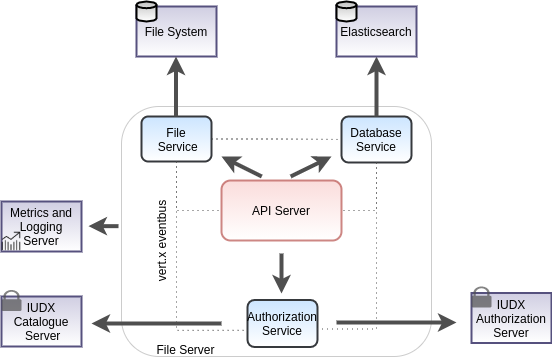

[](https://jenkins.iudx.io/job/iudx%20file-server%20(v3.5.0)%20pipeline/lastBuild/)
[](https://jenkins.iudx.io/job/iudx%20file-server%20(v3.5.0)%20pipeline/lastBuild/jacoco/)
[](https://jenkins.iudx.io/job/iudx%20file-server%20(v3.5.0)%20pipeline/lastBuild/testReport/)
[](https://jenkins.iudx.io/job/iudx%20file-server%20(v3.5.0)%20pipeline/lastBuild/zap/)
[](https://jenkins.iudx.io/job/iudx%20file-server%20(v3.5.0)%20pipeline/lastBuild/Integration_20Test_20Report/)


# iudx-file-server

The file server is [IUDX](https://iudx.org.in) archival, sample file data store which allows users to discovery, download and upload files.
It allows data providers to upload and manage archives of data *resources* and its associated meta-data documents through APIs. It also allows data consumers to query the meta-data and download files as per the consent of the providers.
The consumers can query the metadata and download files from the file server using HTTPs.

<p align="center">

</p>

## Features

- Provides file data access from available resources using standard APIs
- Search APIs for searching available files through meta data search
- Integration with authorization server (token introspection) to serve private files as per the access control policies set by the provider
- Secure data access over TLS
- Scalable, service mesh architecture based implementation using open source components: Vert.X API framework, Elasticsearch for database
- Hazelcast and Zookeeper based cluster management and service discovery


## Prerequisite 
### Make configuration
1. Clone this repo and change directory:
   ```sh 
   git clone https://github.com/datakaveri/iudx-file-server.git && cd iudx-file-server
   ```
2. Make a config file based on the template in `example-configs/config-dev.json` for non-clustered vertx and  `example-configs/config-depl.json` for clustered vertx.
   - Generate a certificate using Lets Encrypt or other methods. Ensure that the domain name of the server is in the CN of the certificate to integrate with IUDX auth server.
   - Make a Java Keystore File and mention its path and password in the appropriate sections
   - Modify the database url and associated credentials in the appropriate sections. Don't modify the field names`upload_dir` and `temp_dir`, leave it as it is from the example-configs.
   - Populate secrets directory with following structure in the present directory:
      ```sh
      secrets/
      ├── all-verticles-configs/ (directory)
      │   ├── config-depl.json (needed for clustered vertx all verticles  in one container)
      │   ├── config-dev.json (needed for non-clustered vertx all verticles in one container/maven based setup)
      │  
      ├── keystore-file.jks (file-server cert in jks format if tls is required at vertx server)
      └── one-verticle-configs/ (directory, needed for clustered vertx in multi-container)
      ``` 
3. Populate `.file-server-api.env` environment file based on template in `example-configs/example-evironment-file(.file-server-api.env)` in the present directory

>**Note** : 
>1. DO NOT ADD actual config with credentials to `example-configs/` directory (even in your local git clone!). 
>2. If you would like to add your own config with different name than config-dev.json and config-depl.json, place in the `secrets/all-verticles-configs/` and follow the instructions in [SETUP.md](SETUP.md)

### External Dependencies Installation

The File Server connects with various external dependencies namely
- ELK stack
- PostgreSQL 
- RabbitMQ
- ImmuDB

Find the installations of the above along with the configurations to modify the database url, port and associated credentials in the appropriate sections
[here](SETUP.md)

## Get Started
### Docker based
1. Install docker and docker-compose (one time setup)
2. Create following docker volumes (one time setup) using the commands:
	```sh
	# Creates fs-volume
	docker volume create fs-volume
	```
3. Build the images 
   ```sh
    ./docker/build.sh
    ```
4. There are following two ways of setting/deploying the file server using docker-compose:
   1. Non-Clustered setup with all verticles running in a single container: 
      - This needs no hazelcast, zookeeper, the deployment can be done on non-swarm too and suitable for development environment.
      - This makes use of iudx/fs-dev:latest image and config-dev.json present at `secrets/all-verticles-configs/config-dev.json`
         ```sh 
         # Command to bring up the non-clustered file-server container
         docker-compose -f docker-compose.yml -f docker-compose.dev.yml up -d
         # Command to bring down the non-clustered file-server container
         docker-compose -f docker-compose.yml -f docker-compose.dev.yml down
         ```
   2. Clustered setup with all verticles running in a single container: 
      - This needs following things:
         - Docker swarm and overlay network having a name 'overlay-net'. Refer [here](https://github.com/datakaveri/iudx-deployment/tree/v3.5.0/docs/swarm-setup.md)
         - Zookeeper running in 'overlay-net' named overlay network. Refer [here](https://github.com/datakaveri/iudx-deployment/tree/v3.5.0/single-node/zookeeper)
      - This makes use of iudx/fs-depl:latest image and config-depl.json present at `secrets/all-verticles-configs/config-depl.json`
         ```sh 
         # Command to bring up the clustered one file-server container
         docker-compose -f docker-compose.yml -f docker-compose.depl.yml up -d
         # Command to bring down the clustered one file-server container
         docker-compose -f docker-compose.yml -f docker-compose.depl.yml down
         ```
#### Note   
1. If you want to try out or do temporary things, such as 
   - use different config file than the standard two
   - Binding the ports of clustered file-server container to host, etc.<br>
   Please use [this](readme/multiple-compose-files.md) technique of overriding/merging compose files i.e. using non-git versioned docker-compose.temp.yml file and do not modify the git-versioned files.
2. Modify the git versioned compose files ONLY when the configuration is needed by all (or its for CI - can preferably name it as docker-compose.ci.yml) and commit and push to the repo.


### Maven based
1. Install jdk 11 and maven
2. Use the maven exec plugin based starter to start the server 
   ```sh 
   mvn clean compile exec:java@file-server
   ```
#### Note
1. Privileged access maybe required to bring up the http server at port 80. 
2. Maven based setup by default uses `secrets/all-verticles-configs/config-dev.json` and is non-clustered setup of verticles. Also it cannot take values from `.file-server.env` file and so the default values apply.
3. If you want to use a different named config called `config-x.json`, need to place it at `secrets/all-verticles-configs/config-x.json` and use following command to bring it up:
   ```sh
   mvn clean compile  exec:java@file-server -Dconfig-dev.file=config-x.json
   ```

### JAR based
1. Install java 11 and maven
2. Set Environment variables
```
export FS_URL=https://<fs-domain-name>
export LOG_LEVEL=INFO
```
3. Use maven to package the application as a JAR
   `mvn clean package -Dmaven.test.skip=true`
4. 2 JAR files would be generated in the `target/` directory
   - `iudx.file.server-cluster-0.0.1-SNAPSHOT-fat.jar` - clustered vert.x containing micrometer metrics
   - `iudx.file.server-dev-0.0.1-SNAPSHOT-fat.jar` - non-clustered vert.x and does not contain micrometer metrics

#### Running the clustered JAR

**Note**: The clustered JAR requires Zookeeper to be installed. Refer [here](https://zookeeper.apache.org/doc/r3.3.3/zookeeperStarted.html) to learn more about how to set up Zookeeper. Additionally, the `zookeepers` key in the config being used needs to be updated with the IP address/domain of the system running Zookeeper.

The JAR requires 3 runtime arguments when running:

* --config/-c : path to the config file
* --hostname/-i : the hostname for clustering
* --modules/-m : comma separated list of module names to deploy

e.g. `java -jar ./fatjar.jar  --host $(hostname) -c configs/config.json -m iudx.file.server.apiserver.FileServerVerticle,iudx.file.server.authenticator.AuthenticationVerticle
,iudx.file.server.database.elasticdb.DatabaseVerticle,iudx.file.server.auditing.AuditingVerticle`

Use the `--help/-h` argument for more information. You may additionally append an `FS_JAVA_OPTS` environment variable containing any Java options to pass to the application.

e.g.
```
$ export FS_JAVA_OPTS="-Xmx4096m"
$ java $FS_JAVA_OPTS -jar target/iudx.file.server-cluster-0.0.1-SNAPSHOT-fat.jar ...
```

#### Running the non-clustered JAR
The JAR requires 1 runtime argument when running:

* --config/-c : path to the config file

e.g. `java -Dvertx.logger-delegate-factory-class-name=io.vertx.core.logging.Log4j2LogDelegateFactory -jar target/iudx.file.server-dev-0.0.1-SNAPSHOT-fat.jar -c configs/config.json`

Use the `--help/-h` argument for more information. You may additionally append an `RS_JAVA_OPTS` environment variable containing any Java options to pass to the application.

e.g.
```
$ export FS_JAVA_OPTS="-Xmx1024m"
$ java $FS_JAVA_OPTS -jar target/iudx.file.server-dev-0.0.1-SNAPSHOT-fat.jar ...
```

### Testing

### Unit tests
1. Run the server through either docker or maven
2. Run the unit tests and generate a surefire report 
   `mvn clean test-compile surefire:test surefire-report:report`
3. Reports are stored in `./target/`

### Integration tests
Integration tests are through Postman/Newman whose script can be found from [here](./src/test/resources/iudx-file-server-api.Release-v2.5.postman_collection.json).
1. Install prerequisites 
   - [postman](https://www.postman.com/) + [newman](https://www.npmjs.com/package/newman)
   - [newman reporter-htmlextra](https://www.npmjs.com/package/newman-reporter-htmlextra)
2. Example Postman environment can be found [here](./src/test/resources/file.iudx.io.Release-v2.5.postman_environment.json)
3. Run the server through either docker or maven
4. Run the integration tests and generate the newman report 
   `newman run <postman-collection-path> -e <postman-environment> --insecure -r htmlextra --reporter-htmlextra-export .`
5. Reports are stored in `./target/`

## Contributing
We follow Git Merge based workflow 
1. Fork this repo
2. Create a new feature branch in your fork. Multiple features must have a hyphen separated name, or refer to a milestone name as mentioned in Github -> Projects 
3. Commit to your fork and raise a Pull Request with upstream

## License
[MIT](./LICENSE.txt)   
   
